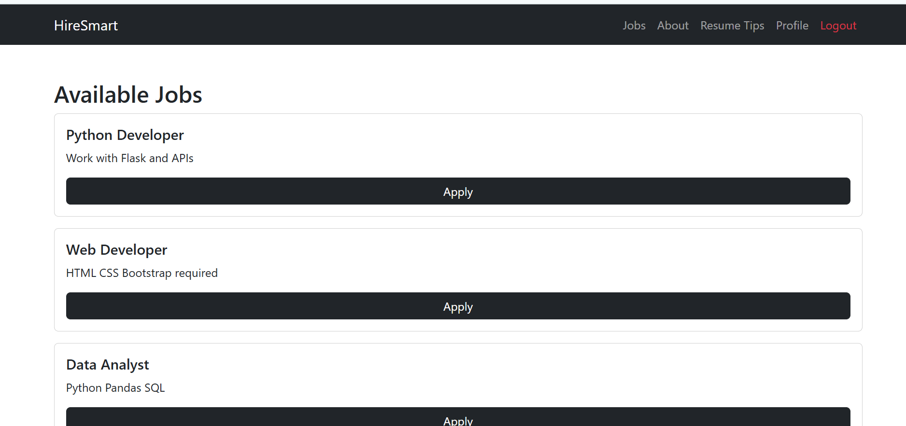
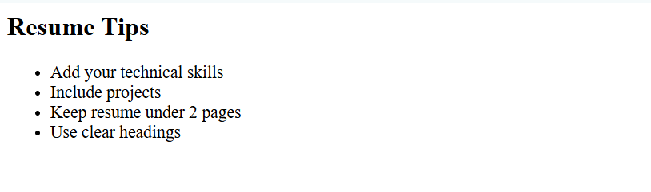
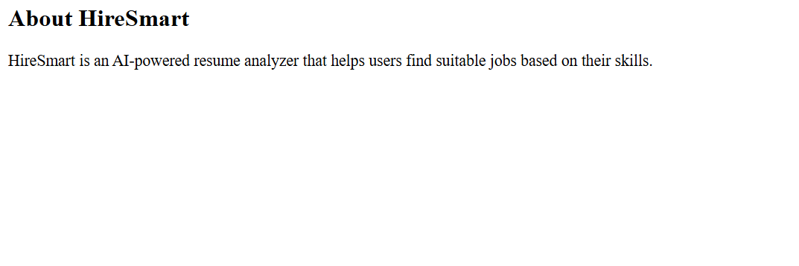

# HireSmart – AI Resume Analyzer

HireSmart is a Flask-based web application that analyzes resumes and matches them with job roles based on skills.
It helps users understand how well their resume matches a job and highlights missing skills needed for improvement.

## Features

* User Registration and Login
* Upload Resume (PDF / TXT)
* Automatic Skill Extraction
* Resume Match Score
* Resume Strength Indicator
* Matched Skills and Missing Skills
* Job Recommendations
* Skill Analysis Graph
* Download Resume Report (PDF)

## Tech Stack

Backend

* Python
* Flask
* Flask-Login
* SQLAlchemy

Frontend

* HTML
* CSS
* Bootstrap
* JavaScript

Libraries

* PyPDF2
* Chart.js
* html2pdf.js

## Project Structure

HireSmart
│
├── .venv/                    
│
├── app/
│   │
│   ├── __pycache__/           
│   │
│   ├── static/
│   │   ├── css/
│   │   │   └── style.css
│   │   │
│   │   └── uploads/           
│   │
│   ├── templates/
│   │   ├── base.html
│   │   ├── dashboard.html
│   │   ├── index.html
│   │   ├── login.html
│   │   ├── register.html
│   │   ├── result.html
│   │   └── upload_resume.html
│   │
│   ├── __init__.py            
│   ├── config.py              
│   ├── models.py              
│   ├── resume_matcher.py      
│   ├── routes.py              
│   ├── skills_db.py           
│   └── utils.py               
│
├── uploads/                   
│
├── Screenshots/               
│   ├── Jobs.png
│   ├── Resume Result.png
│   ├── Tips.png
│   ├── Upload Resume.png
│   └── About.png
│
├── README.md                  
├── requirements.txt           
└── run.py                     

## Installation

### Clone the repository

git clone https://github.com/yourusername/hiresmart.git
cd hiresmart

### Create virtual environment

python -m venv venv

### Activate environment

Windows

venv\Scripts\activate

### Install dependencies

pip install -r requirements.txt

### Run the application

python run.py

### Open in browser

http://127.0.0.1:5000

## How It Works

1. User uploads a resume.
2. The system extracts text from the resume.
3. Skills are identified from the resume.
4. Skills are compared with job requirements.
5. The system calculates a match score.
6. Missing skills and job recommendations are displayed.

## Screenshots

### Jobs Page

### Upload Resume

### Resume Analysis Result

### Resume Tips Page

### About Page

## License

This project is open source and available under the MIT License.
